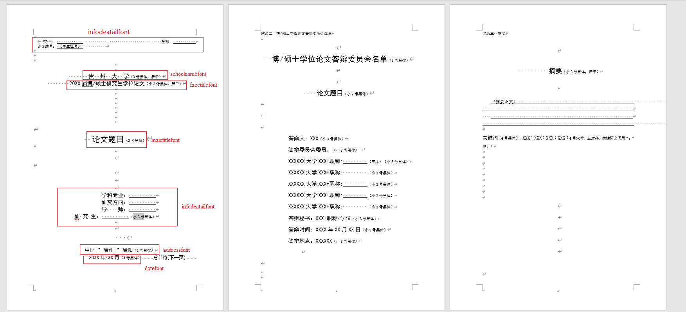

# 贵州大学研究生学位论文模板
制作方: 贵州大学计算机科学与技术学院


基于 article 制作，使用 xelatex 编译


## Task
- [ ] 间距格式调整
- [ ] 输出版本控制(完成部分)
- [ ] 兼容Mac/Linux
- [ ] 兼容 overleaf
- [ ] 兼容 学士
- [ ] 切换为book
- [X] 答辩委员会名单
- [X] 附录 
- [x] 摘要关键字
- [X] 目录

## 未来计划
### 格式调整
对行间距进行复刻
### 版本控制
通过不同命令输出 不同版本的论文格式：
-  \printversion    打印版本
- \evaluateversion 送审版本(盲审)
- \submitversion   提交版本
- \draftversion    草稿版本
## 使用
本文档在Tex live 2021 版本以及 MikTeX 22.3版本编译通过；由于overleaf 上缺少字体，暂时**不能**编译通过；没有在Linux/Mac 下测试。


控制命令:
- `\frontmatter` 前言格式，页数格式为罗马底部居中；
- `\mainmatter` 正文格式，页眉为章节名称以及论文题目，页脚为数字页数居中；
- `\chairman` 答辩主席
- `\expert` 答辩专家
- `\secretary` 答辩秘书

模板参数：
- `type` 模板类型,doctor 为博士master 为硕士


注意:
日期需使用中文分割如`\date{20XX年XX月}` 或者 `\date{20XX年XX月XX日}`
### 版本控制
```latex
\def\evaluateversion{} %输出盲审版本
\def\printversion{}   % 输出打印版本
```
## 例
```latex
\documentclass[type=doctor]{GZUthesis} %打印博士论文。type=master 为硕士论文，默认为硕士
\graduationyear{2021} %毕业年份
\major{学科专业}
\research{研究方向}
\author{学生}
\supervisor{导师}
\stuid{(学号)}
\title{论文题目}
\def\evaluateversion{} %输出盲审版本
\def\printversion{}   % 输出打印版本

\chairman{贵州大学\ 张XX\ 教授}
\expert{贵州大学\ 李XX\ 教授}
```